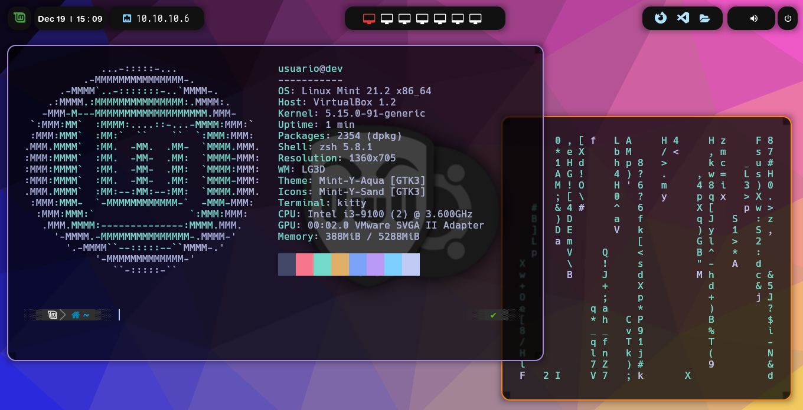

# Bspwm Linux Dotfiles & Automation



## 📌 Objetivo Técnico del Proyecto

Este repositorio contiene una colección de scripts de automatización ("dotfiles") y rutinas de post-instalación de Bspwm para entornos Linux. El objetivo es proporcionar un entorno de escritorio rápido, pre-configurado y estéticamente refinado para perfiles profesionales, priorizando la reproducibilidad y modularidad.

## ⚖️ Enfoque Ético y Profesional

La personalización de entornos Linux (Ricing y Dotfiles) debe tratarse con el mismo rigor que el desarrollo de software. Este proyecto sigue lineamientos estrictos de **DevSecOps**, evitando la inclusión de credenciales, tokens personales o lógica altamente acoplada al host original. **Advertencia de uso**: Revisa el código de los scripts de instalación antes de ejecutarlos para comprender los cambios que realizarán a tu entorno de usuario o sistema de paquetes.

## 🏗️ Arquitectura del Repositorio

El proyecto cuenta con una estructura diseñada y enfocada a la escalabilidad:

- 📂 `configs/`: Almacena los ficheros de configuración reales (Zsh, Kitty, Rofi, Bspwm/Sxhkd).
- 📂 `scripts/`: Contiene la lógica automatizada y el orquestador (`install.sh` y el manejador de publicación).
- 📂 `data/`: Almacena binarios de terceros y assets multimedia como `Fondo.png`.
- 📂 `docs/`: Documentación, tutoriales y atajos de teclado del flujo de trabajo de Bspwm.
- 📂 `tests/`: Batería de pruebas orientadas a validar la integridad estructural y sintáctica (CI).

## 🔄 Flujo de Trabajo DevSecOps: GitLab $\rightarrow$ GitHub

Este repositorio adopta un esquema de **Dual-Repository Topology (Source of Truth Privado / Espejo Público Sanitizado)**.

- **GitLab (Laboratorio Privado)**: Actúa como la verdadera fuente de verdad. Aquí reside el código fuente completo, los pipelines de CI/CD, las secuencias de `tests`, dependencias y toda lógica preliminar. El desarrollo diario y operaciones de rastreo (`fetch`/`pull`) se concentran 100% acá.
- **GitHub (Portafolio Público)**: Solo presenta la cara profesional del código. Su rama principal no incluye entornos de testeo, trazas sensibles o las configuraciones de CI privadas.

## ⚙️ Explicación de `publish_public.ps1`

Para mitigar filtraciones y sostener la separación GitLab $\rightarrow$ GitHub, el repositorio incluye un script oficial de publicación: `scripts/publish_public.ps1`.

### Funcionamiento

1. **Verificación**: Asegura limpieza del working tree y persistencia en la rama `main` del laboratorio.
2. **Sincronización Origen**: Concreta sincronización final y respaldo hacia GitLab.
3. **Escudo / Sanitización**: Construye dinámicamente un checkout `public`. Mediante comandos `git rm --cached`, remueve los artefactos sensibles (CI/CD de GitLab, baterías de Tests, claves/configuraciones locales que no deben ir en la versión pública).
4. **Despliegue Asimétrico**: Ejerce un `push --force` unilateral hacia el origen de GitHub exponiendo la vista pública del proyecto.

### Uso y Atajos Rápidos

```bash
# Instalador automático
git clone https://github.com/devsebastian31/Bspwm.git
cd Bspwm
chmod +x scripts/install.sh
./scripts/install.sh
```

- Rofi Selector: `rofi-theme-selector -> rounded-purple-dark -> Alt-a`
- Puedes revisar todos los demás atajos en [docs/commands.md](docs/commands.md).