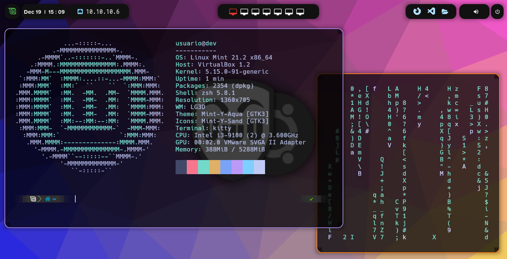

# 🖥️ Bspwm Linux — Dotfiles & Entorno de Escritorio




---

## 🧠 Overview

Este repositorio es una colección completa de **dotfiles y scripts de automatización
de post-instalación** para un entorno de escritorio Linux basado en **Bspwm**, el
gestor de ventanas en mosaico (tiling window manager) orientado a la productividad
y la eficiencia de flujo de trabajo.

El proyecto está diseñado con un enfoque en la **reproducibilidad y modularidad**:
el script de instalación (`install.sh`) automatiza la configuración completa del
entorno desde cero, aplicando todos los archivos de configuración incluidos en
`configs/` sin intervención manual. La estructura sigue lineamientos de
**DevSecOps** aplicados al mundo del ricing Linux, garantizando que ninguna
credencial, token ni configuración sensible específica del host se publique en
el repositorio.

El entorno integra **Bspwm** como gestor de ventanas, **Sxhkd** como daemon de
atajos de teclado, **Polybar** como barra de estado modular, **Rofi** como
lanzador de aplicaciones, **Picom** como compositor con efectos visuales, y
**Kitty** como emulador de terminal de alta performance.

---

## ⚙️ Features

- **Gestor de ventanas en mosaico Bspwm** con configuración (`bspwmrc`)
  completamente personalizada, incluyendo reglas de ventana, nodos, espacios de
  trabajo y comportamientos por aplicación.
- **Daemon de hotkeys Sxhkd** con mapa de atajos de teclado ergonómico
  documentado en `docs/commands.md`, cubriendo gestión de ventanas, espacios,
  lanzador de apps, capturas y más.
- **Barra de estado Polybar** con módulos personalizados: red, batería, volumen,
  fecha/hora, espacio de trabajo activo y scripts auxiliares modulares.
- **Lanzador de aplicaciones Rofi** configurado con el tema
  `rounded-purple-dark`, activable con selector interactivo
  (`rofi-theme-selector → Alt-a`).
- **Compositor Picom** con efectos de transparencia, sombras y animaciones
  configurables desde su propio archivo en `configs/`.
- **Emulador de terminal Kitty** con fuente, esquema de color y layout
  personalizados para máxima legibilidad en el entorno de trabajo.
- **Shell Zsh** con configuración dedicada en `configs/`, incluyendo aliases,
  prompt personalizado y plugins de productividad.
- **Script de instalación automatizado** (`install.sh`) que aplica todos los
  dotfiles, instala dependencias y configura el entorno de forma reproducible.
- **Wallpaper incluido** (`data/wallpapers/Fondo.png`) como referencia visual
  del aspecto final del escritorio.
- **Documentación de atajos** en `docs/commands.md` con referencia completa
  del flujo de trabajo en Bspwm.
- **Estrategia DevSecOps de doble repositorio** con publicación sanitizada
  automatizada a GitHub via `publish_public.ps1`.

---

## 🛠️ Tech Stack

| Componente | Herramienta | Rol en el entorno |
|---|---|---|
| Window Manager | **Bspwm** | Gestión de ventanas en árbol binario de mosaico |
| Hotkey Daemon | **Sxhkd** | Manejo de atajos de teclado globales |
| Status Bar | **Polybar** | Barra de estado modular y scriptable |
| App Launcher | **Rofi** | Lanzador de aplicaciones y selector de ventanas |
| Compositor | **Picom** | Transparencias, sombras y animaciones |
| Terminal | **Kitty** | Emulador de terminal GPU-acelerado |
| Shell | **Zsh** | Shell interactivo con configuración personalizada |
| Scripting | **Bash / Shell** | Scripts de instalación y automatización |
| Publicación | **PowerShell** | Sanitización y sincronización a GitHub |
| Licencia | GPL-3.0 | Copyleft — libre redistribución y modificación |

---

## 📦 Installation

### Prerrequisitos

- Distribución Linux con soporte para **Xorg** (Debian, Arch, Kali, Parrot, etc.)
- Paquetes base: `bspwm`, `sxhkd`, `polybar`, `rofi`, `picom`, `kitty`, `zsh`
- Git instalado en el sistema

### 1. Clonar el repositorio completo (desde GitLab)

```bash
git clone https://gitlab.com/group-programming-lab/Bspwm-linux.git
cd Bspwm-linux
```

### 2. Dar permisos de ejecución al instalador

```bash
chmod +x scripts/install.sh
```

### 3. Ejecutar el script de instalación

```bash
./scripts/install.sh
```

> ⚠️ **Recomendación:** Revisa el contenido de `scripts/install.sh` antes de
> ejecutarlo para comprender qué cambios realizará sobre tu sistema de paquetes
> y directorio de usuario. Los dotfiles son aplicados a `~/.config/`.

### 4. Reiniciar la sesión o recargar Bspwm

```bash
# Recargar configuración de bspwm sin reiniciar sesión
bspc wm -r

# O bien cerrar sesión y volver a iniciar con Bspwm como WM
```

### Instalación manual de componentes individuales

Si prefieres aplicar solo partes del entorno:

```bash
# Copiar configuración de Bspwm
cp configs/bspwmrc ~/.config/bspwm/bspwmrc
chmod +x ~/.config/bspwm/bspwmrc

# Copiar configuración de Sxhkd
cp configs/sxhkdrc ~/.config/sxhkd/sxhkdrc

# Copiar configuración de Polybar
cp -r configs/polybar ~/.config/polybar

# Copiar configuración de Rofi
cp -r configs/rofi ~/.config/rofi

# Copiar configuración de Kitty
cp configs/kitty.conf ~/.config/kitty/kitty.conf

# Copiar configuración de Picom
cp configs/picom.conf ~/.config/picom.conf

# Copiar configuración de Zsh
cp configs/.zshrc ~/.zshrc
```

---

## ▶️ Usage

### Iniciar el entorno Bspwm

Si usas un display manager (LightDM, SDDM, etc.), selecciona **Bspwm** como
sesión de escritorio al iniciar sesión. Si usas `.xinitrc`:

```bash
# Al final de ~/.xinitrc
exec bspwm
```

### Configurar el tema de Rofi

```bash
# Abrir selector de temas interactivo
rofi-theme-selector
# Seleccionar: rounded-purple-dark → confirmar con Alt-a
```

### Atajos de teclado esenciales

Consulta la referencia completa en [`docs/commands.md`](docs/commands.md).
Los atajos más frecuentes inferidos de la configuración típica de Bspwm + Sxhkd:

| Acción | Atajo |
|---|---|
| Abrir terminal (Kitty) | `Super + Return` |
| Abrir lanzador (Rofi) | `Super + d` |
| Cerrar ventana activa | `Super + q` |
| Alternar modo mosaico / flotante | `Super + Space` |
| Cambiar de espacio de trabajo | `Super + 1..9` |
| Mover ventana a otro espacio | `Super + Shift + 1..9` |
| Recargar Sxhkd | `Super + Escape` |
| Recargar configuración Bspwm | `Super + Shift + r` |

### Publicar versión sanitizada a GitHub (DevSecOps)

```powershell
# Desde PowerShell (entorno de desarrollo)
.\publish_public.ps1
```

---

## 🧪 Tests

El proyecto cuenta con pruebas locales para asegurar que el entorno puede validarse sin dependencias externas ni credenciales:

```bash
# Ejecutar verificación de sintaxis de scripts de forma segura
bash tests/test_install.sh
```

Esto ejecutará una prueba "seca" (dry-run) sobre los archivos principales para confirmar su validez antes de hacer modificaciones en el entorno real.

---

## 🤝 Contributing

¡Las contribuciones son bienvenidas para mejorar este portafolio y entorno! Para mantener un código de calidad:

1. Realiza un **Fork** del repositorio.
2. Clona tu fork y prueba el código localmente sin acceso externo (usa mocks si añades funcionalidades).
3. Revisa la guía completa en [CONTRIBUTING.md](CONTRIBUTING.md) para detalles sobre pull requests, ejecución local y configuración del `.env.example`.
4. El repositorio cuenta con un pipeline de **CI/CD en GitHub Actions** que validará automáticamente la instalación, pruebas y el linting de tus Pull Requests.

---

## 📁 Project Structure

```
Bspwm-linux/
│
├── configs/                     # Archivos de configuración de cada herramienta
│   ├── bspwmrc                  # Configuración principal de Bspwm (reglas, workspaces)
│   ├── sxhkdrc                  # Mapa completo de atajos de teclado (Sxhkd)
│   ├── polybar/                 # Configuración de barras y módulos de Polybar
│   │   ├── config.ini           # Configuración principal de Polybar
│   │   └── scripts/             # Scripts auxiliares para módulos (red, volumen, etc.)
│   ├── rofi/                    # Temas y configuración de Rofi
│   │   └── rounded-purple-dark/ # Tema visual activo del lanzador
│   ├── picom.conf               # Configuración del compositor (transparencias, sombras)
│   ├── kitty.conf               # Configuración del emulador de terminal Kitty
│   └── .zshrc                   # Configuración del shell Zsh (aliases, prompt, plugins)
│
├── data/
│   ├── wallpapers/
│   │   └── Fondo.png            # Wallpaper de referencia del escritorio
│   └── packages/
│       └── .gitkeep             # Carpeta para paquetes .deb (excluidos del repo)
│
├── docs/
│   ├── commands.md              # Referencia completa de atajos de teclado Bspwm
│   └── ...                      # Tutoriales y notas adicionales del entorno
│
├── scripts/
│   └── install.sh               # Orquestador de instalación automatizada del entorno
│
├── publish_public.ps1           # Script PowerShell de sanitización y push a GitHub
│
├── .gitignore                   # Excluye: logs, .env, *.pem, *.key, paquetes binarios
├── LICENSE                      # GNU General Public License v3.0
└── README.md                    # Documentación principal del proyecto
```

---

## 🔐 Security

### Buenas prácticas aplicadas al ricing

La personalización de entornos Linux puede implicar la ejecución de scripts
con permisos elevados y la modificación de configuraciones del sistema. Este
proyecto sigue principios de **mínimo privilegio** y **auditoría del código**:

- **Revisar `install.sh` antes de ejecutar:** El instalador modifica el
  directorio de usuario (`~/.config/`) y posiblemente instala paquetes del
  sistema. Es recomendable leerlo íntegramente antes de ejecutarlo en cualquier
  entorno.
- **Sin credenciales en el repositorio:** El `.gitignore` excluye
  explícitamente `.env`, `*.pem`, `*.key`, `credentials.json` y
  `secrets.yaml`, previniendo filtraciones de configuraciones personales del host.
- **Sin paquetes binarios:** Los archivos `*.deb`, `*.tar.gz` y `*.zip` están
  excluidos del repositorio mediante `.gitignore`, manteniendo el repo limpio y
  auditables solo los archivos de configuración de texto plano.
- **Arquitectura DevSecOps dual:** El script `publish_public.ps1` garantiza
  que el repositorio público en GitHub nunca contenga configuraciones sensibles
  ni artefactos de CI/CD internos del laboratorio GitLab.

---

## 🌐 Repository Architecture

Este proyecto sigue una arquitectura distribuida de doble repositorio, separando
el entorno de desarrollo activo del portafolio público:

**GitHub** actúa como espejo sanitizado del entorno — contiene los dotfiles
públicos, la documentación, los diagramas y el wallpaper de referencia,
orientado a la presentación del portafolio técnico.

**GitLab** es la fuente de verdad y laboratorio de desarrollo completo:
contiene el entorno íntegro con scripts de CI/CD, batería de tests de
integridad estructural, configuraciones locales del host y toda la lógica
de automatización interna. El desarrollo diario ocurre exclusivamente aquí.

La sincronización entre entornos está gobernada por `publish_public.ps1`,
que crea una rama temporal sanitizada, elimina artefactos sensibles y hace
push hacia GitHub de forma controlada y auditable.

### 🔗 Full Source Code

👉 Código completo disponible en GitLab:
[https://gitlab.com/group-programming-lab/Bspwm-linux](https://gitlab.com/group-programming-lab/Bspwm-linux)

---

## 🚀 Roadmap

Mejoras sugeridas a partir de la arquitectura y herramientas detectadas:

- **Soporte multi-distribución en `install.sh`:** Añadir detección automática
  del gestor de paquetes (`apt`, `pacman`, `dnf`) para hacer el instalador
  portable entre Debian, Arch y Fedora sin modificación manual.
- **Módulos adicionales de Polybar:** Integrar módulos para clima, estado de
  GPU, temperatura del sistema y notificaciones dunst.
- **Script de rollback:** Crear un `uninstall.sh` que restaure los dotfiles
  originales del usuario en caso de querer revertir el entorno.
- **Temas adicionales de Rofi:** Incluir variantes de color del tema
  `rounded-purple-dark` para adaptar la paleta al wallpaper activo.
- **Configuración de Dunst:** Añadir daemon de notificaciones con estilo
  coherente al resto del entorno visual.
- **Soporte Wayland:** Migración experimental del entorno a
  **Hyprland/Sway** como alternativa a Bspwm en Wayland, manteniendo la
  misma filosofía de configuración modular.
- **Tests de integridad en CI/CD:** Expandir la batería de tests en GitLab
  para validar la sintaxis de `bspwmrc`, `sxhkdrc` y scripts Bash con
  `shellcheck` en cada push.
- **Gestión de múltiples perfiles:** Sistema de perfiles intercambiables
  (trabajo, gaming, minimal) con scripts de activación rápida.

---

## 📄 License

Este proyecto está distribuido bajo la licencia
**GNU General Public License v3.0 (GPL-3.0)**.

La GPL-3.0 garantiza las libertades de uso, estudio, distribución y
modificación, exigiendo que cualquier trabajo derivado se distribuya bajo
los mismos términos de libertad.

📄 [Ver licencia completa](https://github.com/devsebastian44/Bspwm-linux/blob/main/LICENSE)

Copyright © 2025 **Sebastián Zhunaula** (devsebastian44)

---

## 👨‍💻 Author

<table>
  <tr>
    <td align="center">
      <b>Sebastián Zhunaula</b><br/>
      <sub>Full-Stack Developer · Linux Enthusiast · DevSecOps</sub><br/><br/>
      <a href="https://github.com/devsebastian44">
        
      </a>
      <br/>
      <a href="https://gitlab.com/group-programming-lab">
        
      </a>
    </td>
  </tr>
</table>

> Este proyecto forma parte de un portafolio de desarrollo y personalización de
> entornos Linux profesionales, demostrando conocimiento avanzado del ecosistema
> de herramientas de escritorio en sistemas Unix, scripting de automatización y
> principios de DevSecOps aplicados a proyectos de configuración personal.